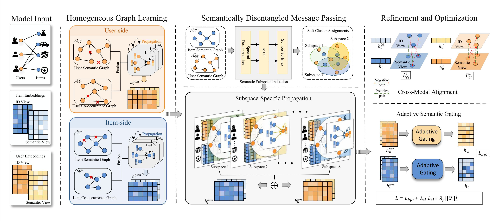

# RFSD

RFSD is a text-attributed graph recommendation model that jointly exploits user/item IDs, profile-derived text representations, homogeneous graphs, and soft cluster-aware interaction propagation. The implementation supports **Amazon-Book**, **Yelp**, and **Steam**, with dataset-specific best hyperparameters loaded automatically from YAML.

## Framework
<p align="center">
  
</p>

## Requirements

- Python 3.8+
- PyTorch
- NumPy
- SciPy

`requirements.txt` is generated from the third-party imports used by `rfsd/*.py`.

Install the dependencies with:

```bash
pip install -r requirements.txt
```

## Text-attributed recommendation datasets

We evaluate RFSD on three public recommendation datasets: **Amazon-Book**, **Yelp**, and **Steam**. Each user and item is associated with a generated textual profile. Every dataset contains training, validation, and test interactions; the validation split can be used for early stopping.

Download the prepared data from [Google Drive](https://drive.google.com/file/d/1PzePFsBcYofG1MV2FisFLBM2lMytbMdW/view), extract it, and place the dataset directories under `data/`.

Dataset statistics used by the current repository are:

| Dataset     |  Users |  Items | Train interactions | Validation interactions | Test interactions |
| ----------- | -----: | -----: | -----------------: | ----------------------: | ----------------: |
| Amazon-Book | 11,000 |  9,332 |            120,464 |                  40,290 |            40,106 |
| Yelp        | 11,091 | 11,010 |            166,620 |                  55,479 |            55,436 |
| Steam       | 23,310 |  5,237 |            316,190 |                 104,897 |           104,835 |

The downloaded/raw data and generated embeddings follow this layout:

```text
data/
├── amazon/
│   ├── trn_mat.pkl       # training interactions (SciPy sparse matrix)
│   ├── val_mat.pkl       # validation interactions (SciPy sparse matrix)
│   ├── tst_mat.pkl       # test interactions (SciPy sparse matrix)
│   ├── usr_prf.pkl       # user text profiles (raw/preprocessing input)
│   ├── itm_prf.pkl       # item text profiles (raw/preprocessing input)
│   ├── usr_emb_np.pkl    # user text embeddings used by RFSD
│   └── itm_emb_np.pkl    # item text embeddings used by RFSD
├── yelp/
│   └── ...
└── steam/
    └── ...
```

The current training pipeline reads `usr_emb_np.pkl` and `itm_emb_np.pkl` directly. A forthcoming `read_profile.py` will read `usr_prf.pkl` and `itm_prf.pkl` and prepare the text embeddings. Until that script is added, make sure the two embedding files are present in each dataset directory.

## Training


```bash
cd rfsd
python main.py --data yelp
```

## Best hyperparameters

The best parameters for all datasets are stored in [`rfsd/best_params.yaml`](rfsd/best_params.yaml). Selecting `--data` automatically loads the corresponding section. New datasets can be added by inserting another top-level section containing at least `data_dir`.


## Evaluation

RFSD reports the following top-*k* ranking metrics after each epoch:

- NDCG@*k*
- Recall@*k*
- Hit Rate@*k*
- MAP@*k*

Training interactions and validation interactions are masked before test ranking.

## Project structure

```text
.
├── requirements.txt
├── rfsd/
│   ├── main.py                # configuration, YAML loading, and CLI
│   ├── best_params.yaml       # dataset-specific best hyperparameters
│   ├── data.py                # data loading and graph construction
│   ├── model.py               # RFSD model and neural components
│   ├── evaluation.py          # objectives and ranking metrics
│   ├── trainer.py             # training, validation, and early stopping
│   └── utils.py               # sparse-matrix and graph utilities
└── data/                      # local datasets (not committed)
```
